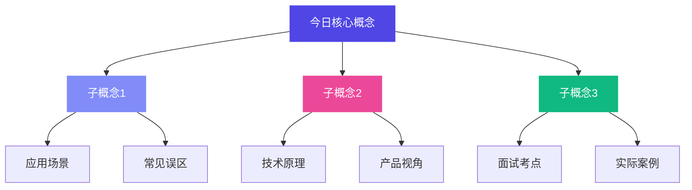

# AI PM Page Style — 每日页面风格标准

## 用途
统一 learning.html 及所有衍生页面的视觉风格。用户要求调整时，同步更新此 Skill。

## 设计系统

### 色彩
```css
:root {
  --bg: #f8f9fb;              /* 页面背景 */
  --surface: #ffffff;         /* 卡片背景 */
  --text: #1a1a2e;            /* 主文字 */
  --text-secondary: #4a5568;  /* 次要文字 */
  --text-muted: #718096;      /* 辅助文字 */
  --accent: #4f46e5;          /* 主色：靛蓝 */
  --accent-light: #818cf8;    /* 浅靛蓝 */
  --accent-warm: #ec4899;     /* 强调：粉红 */
  --border: #e2e8f0;         /* 边框 */
  --border-light: #edf2f7;   /* 浅边框 */
  --shadow: 0 4px 20px rgba(0,0,0,0.06);
  --shadow-hover: 0 12px 40px rgba(0,0,0,0.1);
  --success: #10b981;         /* 完成状态 */
  --warning: #f59e0b;         /* 待办状态 */
  --danger: #ef4444;          /* 逾期/未完成状态 */
}

### 状态徽章（Status Badge）
用于 day-XX.html 顶部和 learning.html 日历，表示学习状态：

| 状态 | 样式 | 使用场景 |
|------|------|---------|
| 等待学习 | `⏳ 等待学习` 灰色半透明 | Day开始前 |
| 已完成 | `✅ 已完成` 绿色背景+边框 | 微信测验后我更新 |
| 未完成 | `🔴 未完成` 红色背景+边框 | 超过当日未学习 |

CSS：
```css
.status-badge {
  display: inline-flex; align-items: center; gap: 0.4rem;
  padding: 0.4rem 1rem; border-radius: 50px; font-size: 0.8rem;
}
.status-waiting { background: rgba(255,255,255,0.2); color: white; backdrop-filter: blur(8px); }
.status-done { background: rgba(16,185,129,0.1); color: var(--success); border: 1px solid var(--success); }
.status-late { background: rgba(239,68,68,0.08); color: var(--danger); border: 1px solid var(--danger); }
```

### 字体
- 中文：`Noto Sans SC`（Google Fonts）
- 英文/数字：`Inter`（Google Fonts）
- 后备：`-apple-system, BlinkMacSystemFont, sans-serif`

### 圆角
- 卡片：`16px-20px`
- 按钮：`50px`（药丸形）
- 小标签：`20px`
- 输入框/进度条：`10px-12px`

### 阴影
- 默认卡片：`0 4px 20px rgba(0,0,0,0.06)`
- Hover状态：`0 12px 40px rgba(0,0,0,0.1)`
- 渐变CTA：`0 8px 30px rgba(0,0,0,0.15)`

### 动画
- 滚动渐显：`opacity 0→1, translateY(30px→0), 0.7s cubic-bezier(0.4,0,0.2,1)`
- 进度条：`width 0→target, 1.2s cubic-bezier(0.4,0,0.2,1)`
- 数字计数：`ease-out cubic, 2s`
- Hover上浮：`translateY(-2px to -4px), 0.3s`

## 页面模块标准

### 每日任务模块
```html
<div class="daily-tasks">
  <div class="task-card">
    <div class="task-checkbox"></div>
    <div class="task-content">
      <h4>任务标题</h4>
      <p>任务描述</p>
    </div>
  </div>
</div>
```

### 知识图谱模块
```html
<div class="mindmap-section">
  <h3>🧠 今日知识图谱</h3>
  <div class="mindmap-container">
    <div class="mermaid">
      graph TD
        A[核心概念] --> B[子概念1]
        A --> C[子概念2]
    </div>
  </div>
</div>
```

### 得分记录模块
```html
<div class="score-section">
  <div class="score-display">
    <span class="score-number">0</span>/30
  </div>
  <div class="score-bar">
    <div class="score-fill"></div>
  </div>
</div>
```

## 响应式断点
- 桌面：`> 1024px` — 双列布局
- 平板：`768px - 1024px` — 单列，间距缩小
- 手机：`< 768px` — 全宽卡片，隐藏侧边栏，汉堡菜单

## 特殊组件

### 学习日历
```css
.calendar-grid {
  display: grid;
  grid-template-columns: repeat(7, 1fr);
  gap: 8px;
}

.calendar-day {
  aspect-ratio: 1;
  border-radius: 12px;
  display: flex;
  align-items: center;
  justify-content: center;
  font-weight: 600;
  cursor: pointer;
  transition: all 0.3s;
}

.calendar-day.completed {
  background: var(--success);
  color: white;
}

.calendar-day.today {
  border: 2px solid var(--accent);
  color: var(--accent);
}

.calendar-day:hover {
  transform: scale(1.1);
}
```

### 进度环
```css
.progress-ring {
  width: 120px;
  height: 120px;
  position: relative;
}

.progress-ring-circle {
  fill: none;
  stroke: var(--accent);
  stroke-width: 8;
  stroke-linecap: round;
  transform: rotate(-90deg);
  transform-origin: 50% 50%;
}

.progress-text {
  position: absolute;
  top: 50%;
  left: 50%;
  transform: translate(-50%, -50%);
  font-size: 1.5rem;
  font-weight: 800;
  color: var(--text);
}
```

## 页面模板示例

### Day XX 页面结构
```html
<!DOCTYPE html>
<html lang="zh-CN">
<head>
  <meta charset="UTF-8">
  <meta name="viewport" content="width=device-width, initial-scale=1.0">
  <title>Day XX · 主题 | AI学习之旅</title>
  <link rel="stylesheet" href="styles.css">
</head>
<body>
  <nav>...</nav>
  
  <header class="day-header">
    <h1>Day XX · 今日主题</h1>
    <div class="progress-indicator">
      <span>已完成 X/XX 天</span>
    </div>
  </header>
  
  <main>
    <section class="story-section">
      <h2>📖 今日故事</h2>
      <div class="story-content">...</div>
    </section>
    
    <section class="knowledge-section">
      <h2>🔍 核心解密</h2>
      <div class="knowledge-content">...</div>
    </section>
    
    <section class="tasks-section">
      <h2>✅ 今日任务</h2>
      <div class="daily-tasks">...</div>
    </section>
    
    <section class="mindmap-section">
      <h2>🧠 知识图谱</h2>
      <div class="mindmap-container">...</div>
    </section>
    
    <section class="score-section">
      <h2>🎯 今日得分</h2>
      <div class="score-display">...</div>
    </section>
  </main>
  
  <footer>...</footer>
  
  <script src="scripts.js"></script>
</body>
</html>
```

## Mermaid 思维导图标准

### 每日知识图谱格式


- 主节点用 `--accent` (#4f46e5)
- 子节点用 `--accent-light` (#818cf8) 或 `--accent-warm` (#ec4899) 或 `--success` (#10b981)
- 文字白色
- 无边框

## 版本控制
- 此 Skill 文件修改后，需同步更新 learning.html 的对应样式
- 每次风格更新记录变更日志在此文件底部

## 变更日志
- 2026-04-23: v1.0 初始版本，基于当前 learning.html 浅色主题
- 2026-04-24: 新增 Mermaid 加载规范与静态 fallback
- 2026-04-24: 新增写作风格规范 —— **禁止生成表格**，用户明确要求直接文字表述

## 写作风格规范（重要）

### 用户明确要求（2026-04-24 00:13）
**不要生成表格，直接表述。**

### 规范细则
- ❌ **禁止用表格**（`| 列A | 列B |` 格式）
- ❌ **禁止用列表对比**（`- A vs B` 的对比列表）
- ✅ **必须用连贯段落文字**直接说明差异、关系、逻辑
- ✅ 可以用短句分行，但不能是表格/对比列表形式
- ✅ 比喻、场景化描述优先

### 示例
❌ 错误：
```
| 传统PM | AI PM |
|---|---|
| 定义功能 | 定义效果 |
| 确定性交付 | 不确定性管理 |
```

✅ 正确：
```
传统产品经理像画一张精确的装配图，你按下开关灯必须亮。AI产品经理不一样，他设计的是人和AI之间的一场协作对话。比如用户说"帮我写辞职信"，传统PM会让用户填表格选模板，AI PM则让AI先问一句"你想温和一点还是直接一点"，然后根据回答动态调整。所以传统PM怕用户点错按钮，AI PM怕AI给的结果不在用户想要的区间里。
```

### 踩坑记录（2026-04-24）
- ❌ 错误：测验评分回复里用了表格对比用户答案和正确答案
- ❌ 错误：概念解释时用了"| 维度 | 你的答案 | 更准的说法 |" 表格
- ✅ 修复：用户明确声明"不要生成表格"，以后所有回复、所有页面内容、所有Skill更新，均用纯文字段落表述
- ✅ 修复：ai-pm-daily-content 和 ai-pm-job-hunt 子Skill同步更新此规范

## Mermaid 知识图谱加载规范（重要）

### 问题背景
Mermaid.js CDN 在中国大陆可能加载失败，导致知识图谱显示💣错误图标。必须提供降级方案。

### 标准实现
```html
<!-- 知识图谱区域 -->
<div class="mindmap-local">
    <div class="mermaid">
graph LR
    A[节点A] --> B[节点B]
    </div>
    <!-- 静态降级：JS加载失败时显示 -->
    <div id="mindmap-fallback" style="display:none;">
        <div style="background:var(--bg); border-radius:10px; padding:1.2rem; font-size:0.85rem; line-height:2; color:var(--text-secondary);">
            <div style="font-weight:700; color:var(--accent); margin-bottom:0.5rem;">知识树（静态版）</div>
            <!-- 手动写出树形结构，确保内容可读 -->
        </div>
    </div>
</div>
```

### JS加载逻辑（3个CDN轮询 + 8秒超时降级）
```javascript
var cdns = [
    'https://cdn.jsdelivr.net/npm/mermaid@10/dist/mermaid.min.js',
    'https://unpkg.com/mermaid@10/dist/mermaid.min.js',
    'https://cdnjs.cloudflare.com/ajax/libs/mermaid/10.6.1/mermaid.min.js'
];
var fallbackTimer = setTimeout(showFallback, 8000);
function showFallback() {
    var fb = document.getElementById('mindmap-fallback');
    if (fb) fb.style.display = 'block';
    var mm = document.querySelector('.mermaid');
    if (mm) mm.style.display = 'none';
}
// 加载成功则清除timer，失败则轮询下一个CDN
```

### 踩坑记录（2026-04-24）
- ❌ 错误：只放一个CDN，没fallback，用户看到💣
- ❌ 错误：Mermaid语法中有中文字符导致解析失败（`不是功能`中的"不"字）
- ✅ 修复：3个CDN轮询 + 8秒超时自动降级到静态文本版
- ✅ 修复：Mermaid中避免中文字符作为节点标识，用英文ID + 中文label
